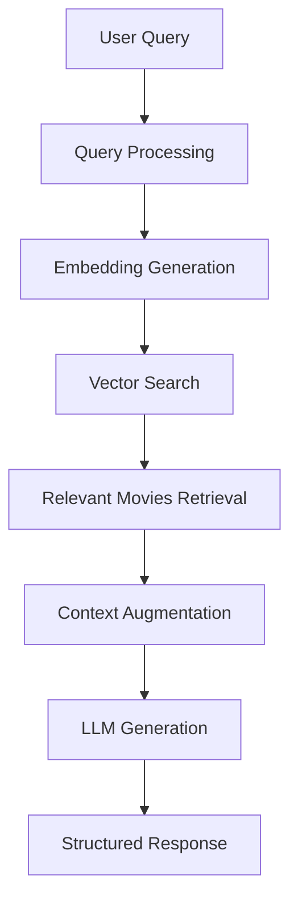

# RAG Applications

<div align="center">
  <h3>🔍 Retrieval-Augmented Generation</h3>
  
  <p>
    
    
    
  </p>
</div>

This directory contains a comprehensive implementation of Retrieval-Augmented Generation (RAG) through a practical movie recommendation system. Learn how to build intelligent applications that combine the power of large language models with external knowledge retrieval.

📖 **Blog Post**: [GenAI Series: Building RAG Applications](https://www.mlwhiz.com/p/genai-series-building-rag-applications)

## 🎬 Project Overview

### Movie Recommendation RAG System
Our implementation demonstrates RAG principles through a movie recommendation engine that:
- **Retrieves** relevant movies based on user queries
- **Augments** LLM context with movie metadata
- **Generates** personalized recommendations with explanations

### Dataset
- **Source**: TMDB (The Movie Database) metadata from Kaggle
- **Content**: Movie titles, plots, genres, ratings, cast information
- **Size**: Comprehensive collection of popular movies with rich metadata

## 🏗️ Architecture Overview



### Core Components
1. **Data Pipeline**: Loading and preprocessing movie metadata
2. **Embedding System**: Converting text to vector representations
3. **Vector Database**: Efficient similarity search with ChromaDB
4. **Retrieval Engine**: Multiple strategies for finding relevant content
5. **Generation System**: Google Gemini for response creation

## 🛠️ Implementation Details

### 📁 Contents
```
4_RAG/
├── README.md                    # This documentation
└── RAG Code.ipynb              # Complete implementation notebook
```

### Technology Stack
- **Embeddings**: SentenceTransformers (`all-mpnet-base-v2`)
- **Vector Database**: ChromaDB for similarity search
- **Language Model**: Google Gemini for response generation
- **Data Processing**: Pandas for metadata manipulation
- **Structured Output**: Pydantic models for response formatting

## 🔄 RAG Workflow Implementation

### 1. Data Loading and Preprocessing
```python
# Movie metadata processing
movies_df = load_dataset(DATASET_NAME, split="train")
movies_df = movies_df.map(format_movie_data)
```

### 2. Embedding Creation
```python
# Generate vector embeddings for movie descriptions
embeddings = model.encode(movie_descriptions)
```

### 3. Vector Database Setup
```python
# ChromaDB collection for similarity search
collection = client.create_collection(
    name="movies",
    embedding_function=embedding_function
)
```

### 4. Retrieval Strategies

#### Basic Retrieval
- Simple semantic similarity search
- Query expansion for improved recall
- Relevance scoring and ranking

#### HyDE (Hypothetical Document Embedding)
- Generate hypothetical movie descriptions
- Enhanced semantic matching
- Better retrieval for abstract queries

#### Query Decomposition
- Break complex queries into sub-queries
- Comprehensive result aggregation
- Multi-faceted recommendation approach

### 5. Response Generation
```python
# Structured output with Pydantic
class MovieRecommendation(BaseModel):
    title: str
    reason: str
    rating: float
    genres: List[str]
```

## 🎯 Key Features

### Multi-Strategy Retrieval
- **Semantic Search**: Understanding query intent and context
- **Hybrid Approaches**: Combining multiple retrieval methods
- **Query Enhancement**: Expanding and refining user queries

### Intelligent Recommendations
- **Theme-Based**: Movies matching specific themes or moods
- **Genre-Aware**: Recommendations within preferred genres
- **Plot-Driven**: Content-based similarity matching
- **Contextual**: Understanding user preferences and context

### Structured Responses
- **JSON Output**: Structured data for easy integration
- **Detailed Explanations**: Why each movie was recommended
- **Metadata Inclusion**: Ratings, genres, cast information
- **Confidence Scoring**: Relevance indicators for recommendations

## 📊 Retrieval Methods Comparison

| Method | Strengths | Use Cases | Performance |
|--------|-----------|-----------|-------------|
| **Basic Retrieval** | Simple, fast, reliable | Direct movie searches | High precision |
| **HyDE** | Better abstract queries | Mood-based recommendations | Medium precision, high recall |
| **Query Decomposition** | Complex multi-part queries | Detailed requirement matching | High coverage |

## 🎨 Example Use Cases

### Theme-Based Recommendations
```
Query: "I want something dark and psychological"
Response: Recommendations for psychological thrillers with detailed explanations
```

### Genre Exploration
```
Query: "Show me the best sci-fi movies with time travel"
Response: Curated list of time travel sci-fi films with ratings and plots
```

### Mood Matching
```
Query: "I need something uplifting after a hard day"
Response: Feel-good movies with positive themes and high ratings
```

### Actor/Director Focus
```
Query: "Movies similar to Christopher Nolan's style"
Response: Films with complex narratives, non-linear storytelling
```

## 🔧 Technical Implementation

### Embedding Pipeline
1. **Text Preprocessing**: Clean and normalize movie descriptions
2. **Chunking Strategy**: Optimize text segments for embedding
3. **Vector Generation**: Create high-quality embeddings
4. **Storage Optimization**: Efficient vector database management

### Retrieval Optimization
- **Similarity Thresholds**: Balanced precision-recall trade-offs
- **Result Ranking**: Multi-factor relevance scoring
- **Diversity Enhancement**: Avoid redundant recommendations
- **Context Window Management**: Optimal information selection

### Response Quality
- **Fact Checking**: Verify movie information accuracy
- **Coherence Validation**: Ensure logical recommendation explanations
- **Personalization**: Adapt responses to user preferences
- **Safety Filtering**: Remove inappropriate content

## 📈 Performance Metrics

### Retrieval Quality
- **Relevance Score**: How well retrieved movies match queries
- **Diversity Index**: Variety in recommendation types
- **Coverage Rate**: Percentage of database effectively searchable
- **Response Time**: Query processing and generation speed

### User Experience
- **Recommendation Accuracy**: User satisfaction with suggestions
- **Explanation Quality**: Clarity and helpfulness of reasoning
- **System Responsiveness**: End-to-end response times
- **Result Consistency**: Stable performance across query types

## 🚀 Getting Started

### Prerequisites
```bash
pip install chromadb sentence-transformers google-generativeai pandas datasets
```

### Quick Start
1. **Open the Notebook**: Launch `RAG Code.ipynb`
2. **Configure APIs**: Set up Google Gemini API credentials
3. **Run Data Pipeline**: Execute data loading and processing cells
4. **Test Queries**: Try different movie recommendation requests
5. **Explore Methods**: Compare different retrieval strategies

### Customization Options
- **Dataset Swapping**: Use different movie databases
- **Embedding Models**: Experiment with various embedding approaches
- **LLM Integration**: Try different language models
- **Retrieval Tuning**: Adjust similarity thresholds and ranking

## 💡 Learning Outcomes

### RAG Fundamentals
- Understanding retrieval-augmented generation principles
- Vector database setup and management
- Embedding strategies for text data
- Query processing and enhancement techniques

### Practical Skills
- Building end-to-end RAG applications
- Implementing multiple retrieval strategies
- Structured output generation with LLMs
- Performance optimization and evaluation

### System Design
- Scalable RAG architecture patterns
- Database and embedding management
- API integration and error handling
- User experience optimization

## 🔗 Related Resources

- **Blog Post**: [Building RAG Applications](https://www.mlwhiz.com/p/genai-series-building-rag-applications)
- **MLWhiz Series**: [Complete GenAI Series](https://www.mlwhiz.com/)
- **ChromaDB Documentation**: [Official ChromaDB Guide](https://docs.trychroma.com/)
- **SentenceTransformers**: [Embedding Models](https://www.sbert.net/)

## 🎓 Next Steps

1. **Explore Advanced RAG**: Check out `5_Advanced_RAG/` for sophisticated techniques
2. **Experiment with Data**: Try different datasets and domains
3. **Optimize Performance**: Fine-tune retrieval and generation parameters
4. **Scale the System**: Implement production-ready optimizations
5. **Add Features**: Incorporate user feedback and personalization

---

<div align="center">
  <p>
    🚀 <strong>Part of the <a href="https://www.mlwhiz.com/">MLWhiz</a> GenAI Series</strong> 🚀
  </p>
</div>