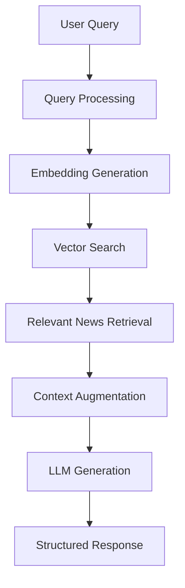

# STOCK NEWS QUESTION AND ANSWERING RAG BOT

<div align="center">
  <h3>🔍 Retrieval-Augmented Generation</h3>
</div>


### Stock News RAG System
- **Retrieves** relevant stock news based on user queries
- **Augments** LLM context with news metadata
- **Generates** personalized answers with explanations

### Dataset
- **Source**: Stock news articles embedded in JSON format
- **Content**: News title, link, ticker, full article, company

## 🏗️ Architecture Overview



### Core Components
1. **Data Pipeline**: Loading and preprocessing news metadata
2. **Embedding System**: Converting text to vector representations
3. **Vector Database**: Efficient similarity search with ChromaDB
4. **Retrieval Engine**: Multiple strategies for finding relevant content
5. **Generation System**: Multiple LLMs for response creation

## 🛠️ Implementation Details

### 📁 Contents
```
├── README.md                    # This documentation
└── Stock_News_QnA.ipynb         # Complete implementation notebook
```

### Technology Stack
- **Embeddings**: SentenceTransformers (`all-mpnet-base-v2`)
- **Vector Database**: ChromaDB for similarity search
- **Language Model**: Gemini, Cohere, Llama and Mistral for response generation
- **Data Processing**: Pandas for metadata manipulation
- **Structured Output**: Pydantic models for response formatting

## 🔄 RAG Workflow Implementation

### 1. Data Loading and Preprocessing
#### Load and preprocess news data


### 2. Embedding Creation
#### Generate vector embeddings for news and it's metadata


### 3. Vector Database Setup
#### ChromaDB collection for similarity search


### 4. Retrieval Strategies

#### Basic Retrieval
- Simple semantic similarity search
- Query expansion for improved recall
- Relevance scoring and ranking

#### HyDE (Hypothetical Document Embedding)
- Generate hypothetical news descriptions
- Enhanced semantic matching
- Better retrieval for abstract queries

#### Query Decomposition
- Break complex queries into sub-queries
- Comprehensive result aggregation


## 🎯 Key Features

### Multi-Strategy Retrieval
- **Semantic Search**: Understanding query intent and context
- **Hybrid Approaches**: Combining multiple retrieval methods
- **Query Enhancement**: Expanding and refining user queries


## 📊 Retrieval Methods Comparison

| Method | Strengths | Use Cases | Performance |
|--------|-----------|-----------|-------------|
| **Basic Retrieval** | Simple, fast, reliable | Direct news searches | High precision |
| **HyDE** | Better abstract queries | Inspiring stories | Medium precision, high recall |
| **Query Decomposition** | Complex multi-part queries | Detailed requirement matching | High coverage |


## 🔧 Technical Implementation

### Embedding Pipeline
1. **Chunking Strategy**: Optimize text segments for embedding
2. **Vector Generation**: Create high-quality embeddings
3. **Storage Optimization**: Efficient vector database management

### Retrieval Optimization
- **Similarity Thresholds**: Balanced precision-recall trade-offs
- **Result Ranking**: Multi-factor relevance scoring
- **Diversity Enhancement**: Avoid redundant information
- **Context Window Management**: Optimal information selection

### Response Quality
- **Fact Checking**: Verify news information accuracy
- **Coherence Validation**: Ensure logical explanations
- **Personalization**: Adapt responses to user preferences
- **Safety Filtering**: Remove inappropriate content

## 📈 Performance Metrics

### Retrieval Quality
- **Relevance Score**: How well retrieved news matches queries
- **Diversity Index**: Variety in news types
- **Coverage Rate**: Percentage of database effectively searchable
- **Response Time**: Query processing and generation speed

### User Experience
- **Answer Accuracy**: User satisfaction with suggestions
- **Explanation Quality**: Clarity and helpfulness of reasoning
- **System Responsiveness**: End-to-end response times
- **Result Consistency**: Stable performance across query types


## 🎓 Next Steps

1. **Experiment with Data**: Try different datasets, like quarterly and yearly financial reports
2. **Optimize Performance**: Fine-tune retrieval and generation parameters
3. **Scale the System**: Implement production-ready optimizations
4. **Add Features**: Incorporate user feedback and personalization

---
